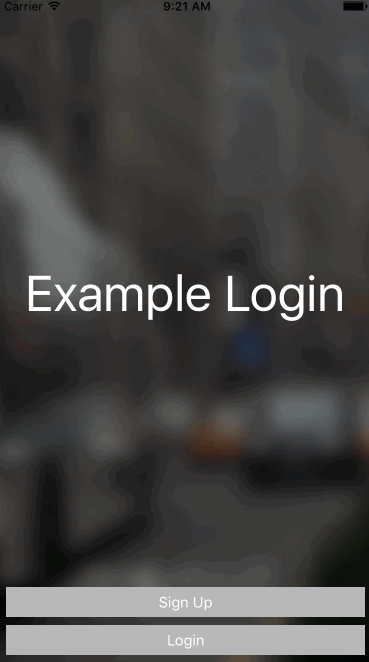

<p align="center">
  
</p>

[][podLink]
[][mitLink]


<p align="center">
  
</p>

SwiftVideoBackground is an easy to use Swift framework that provides the ability to add a UIView of a video playing in the background to any ViewController. This provides a beautiful UI for login screens, or splash pages, as implemented by Spotify and many others.

1. [Requirements](#requrements)
2. [Integration](#integration)
    - [Cocoapods](#cocoapods)
    - [Carthage](#carthage)
    - [Swift Package Manager](#swift-package-manager)
    - [Manually](#manually)
3. [Usage](#usage)
4. [Example](#example)
5. [License](#license)

## Requirements

- Swift 3
- iOS 10
- Xcode 8

## Integration

####CocoaPods
You can use [CocoaPods](http://cocoapods.org/) to install `SwiftVideoBackground`by adding it to your `Podfile`:
```ruby
platform :ios, '10.0'
use_frameworks!

target 'MyApp' do
	pod 'SwiftVideoBackground'
end
```
Note: your iOS deployment target must be 10.0:

####Carthage
You can use [Carthage](https://github.com/Carthage/Carthage) to install `SwiftVideoBackground` by adding it to your `Cartfile`:
```
github "dingwilson/SwiftVideoBackground"
```

####Swift Package Manager
You can use [The Swift Package Manager](https://swift.org/package-manager) to install `SwiftVideoBackground` by adding the proper description to your `Package.swift` file:
```swift
import PackageDescription

let package = Package(
    name: "YOUR_PROJECT_NAME",
    targets: [],
    dependencies: [
        .Package(url: "https://github.com/dingwilson/SwiftVideoBackground.git", versions: Version(1,0,0)..<Version(2, .max, .max)),
    ]
)
```

Note: the [Swift Package Manager](https://swift.org/package-manager) is still in early design and development, for more infomation checkout its [GitHub Page](https://github.com/apple/swift-package-manager)

####Manually

To use this library in your project manually you may:  

1. for Projects, just drag BackgroundVideo.swift to the project tree
2. for Workspaces, include the whole SwiftVideoBackground.xcodeproj

## Usage

```swift
import SwiftVideoBackground
```
Import the framework into the ViewController

```swift
var backgroundVideo : BackgroundVideo!
```
Link a UIView within a ViewController within the Storyboard to a BackgroundVideo item, or link it programmatically.

```swift
backgroundVideo.createBackgroundVideo(name: "Background", type: "mp4")
```
```swift
backgroundVideo.createBackgroundVideo(name: "Background", type: "mp4", alpha: 0.5)
```
Use the `createBackgroundVideo` function, with the name of the video or gif under `name`, and the file type (popular ones include mp4, mov, and gif) under `type`. You can also include an alpha value between 0 and 1 under `alpha`, to adjust the brightness of the video.

Note: Make sure you have added a video file to the project, and targeted the project. Also, make sure that you have set the module to `SwiftVideoBackground` for the BackgroundVideo UIView.

## Example

To view the included example `ExampleLogin`, simply run `pod install` to get the latest version of the `SwiftVideoBackground`, and then open the `ExampleLogin.xcworkspace` and run on a compatible iPhone simulator or iOS device.

Note: If you have used SwiftVideoBackground in your own app, please feel free to submit a PR to have a link of your app added to this section!

## License

`SwiftVideoBackground` is released under an [MIT License][mitLink]. See `LICENSE` for details.

**Copyright &copy; 2016-present Wilson Ding.**

*Please provide attribution, it is greatly appreciated.*

[podLink]:https://cocoapods.org/pods/SwiftVideoBackground
[mitLink]:http://opensource.org/licenses/MIT
